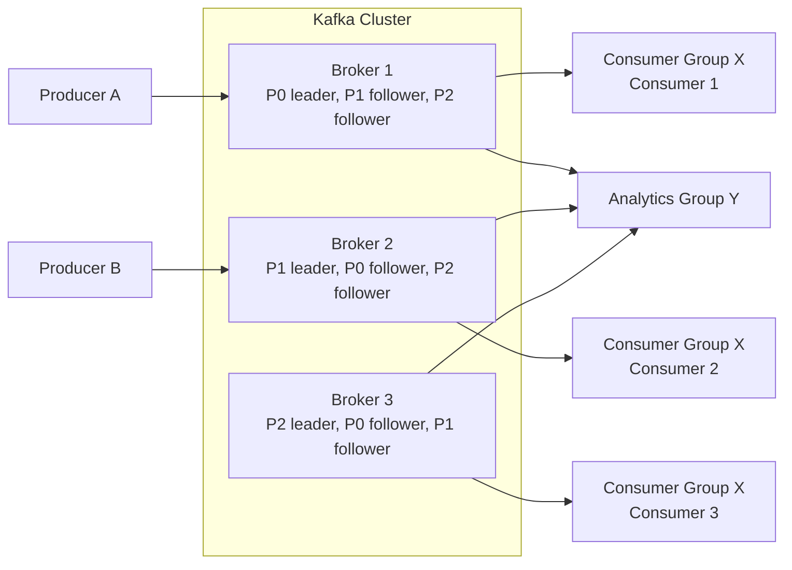
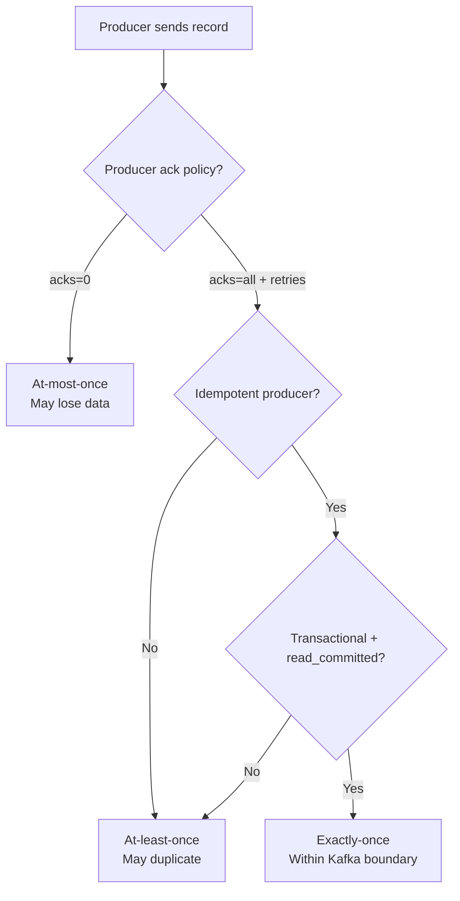

More than 80% of Fortune 100 companies run Apache Kafka in production. It moves trillions of messages a day at companies like Uber, Walmart, Tesla, and Robinhood — and yet most engineers can describe what it does (a "message queue") without ever explaining how it actually works. That gap matters, because Kafka is not a queue. It is a distributed, append-only log, and the difference shapes everything from how you partition data to whether your "exactly-once" pipeline is actually exactly-once.

This post walks through the parts of Kafka you need to reason about as a backend engineer: brokers, topics, partitions, consumer groups, and the delivery semantics that determine whether your system loses messages, duplicates them, or processes them exactly once.

## What Kafka Actually Is

Kafka started at LinkedIn as a way to unify the firehose of operational data — clicks, page views, service logs, metrics — into a single pipeline. The team's insight was that most "messaging" problems are really log problems: append events in order, let many readers consume them at their own pace, and never let a slow consumer block a fast producer.

The result is a system with three properties that distinguish it from a traditional broker:

- **Storage and compute are separate.** Brokers store the log; producers and consumers are independent client libraries that scale horizontally without touching broker state.
- **The log is the database.** Topics are append-only, immutable sequences of events. Consumers don't pop messages — they read at an offset and advance it.
- **Partitions are the unit of parallelism.** A topic is split across N partitions; producers, consumers, and replication all parallelize at this granularity.

That model is why Kafka can sustain millions of events per second per cluster with single-digit-millisecond latencies, and why the same topic can feed real-time fraud detection, batch ETL into a warehouse, and a search index without any of them stepping on each other.

## The Core Architecture

A Kafka deployment has a small number of moving parts, but each one carries weight. Here's how they fit together for a single topic with three partitions and a replication factor of three:



### Brokers and the Cluster

A **broker** is a single Kafka server. Brokers form a cluster, share metadata, and replicate partitions to each other. Modern Kafka (4.x) runs in KRaft mode, where a small set of controller brokers handle cluster metadata via a Raft consensus log — no more ZooKeeper dependency. The controller decides who leads which partition and reassigns leadership when a broker dies.

### Topics, Partitions, and Offsets

A **topic** is a named stream of events. Internally, the topic is split into **partitions**, each of which is a strictly ordered log stored on disk. Each event in a partition gets a monotonically increasing **offset** — once assigned, an offset is never reused.

Three things to remember:

1. **Order is per-partition, not per-topic.** If you need events for a given customer to arrive in order, route them all to the same partition (usually by hashing a key).
2. **Partition count caps consumer parallelism.** A topic with 6 partitions can be read by at most 6 active consumers in one group. Plan ahead — increasing partitions later breaks key-based ordering.
3. **Partitions are physical files.** Each partition lives on a specific broker as a set of segment files plus an index. Retention is per-partition, sized either by time (e.g., 7 days) or bytes.

### Replication

Every partition has one **leader** and zero or more **followers**. Producers and consumers only talk to the leader; followers fetch from the leader to stay in sync. The set of followers that are caught up is the **in-sync replica (ISR)** set. If the leader dies, the controller promotes an ISR member to leader. This is how Kafka tolerates broker failure without data loss — provided you've configured `acks=all` and `min.insync.replicas` appropriately.

This partition-leader model is conceptually similar to the sharding patterns covered in [Database Sharding Explained](/blogs/database-sharding-explained/) — both shard data horizontally, and both pay the same tax in operational complexity for the throughput gain.

## Producers and Consumers

Producers and consumers are libraries, not services. They speak the Kafka wire protocol directly to brokers.

### Producers

A producer batches records, chooses a partition (round-robin, by key hash, or via a custom partitioner), and sends. The interesting knobs:

- `acks=0` — fire and forget. Fastest, lossy.
- `acks=1` — wait for the leader to write. Survives consumer crashes, not leader crashes.
- `acks=all` — wait for the leader and all in-sync replicas. Durable, slower.
- `enable.idempotence=true` — broker dedupes producer retries using a producer ID and per-partition sequence numbers. No more accidental duplicates when a request times out and gets retried.

```java
Properties props = new Properties();
props.put("bootstrap.servers", "broker1:9092,broker2:9092");
props.put("acks", "all");
props.put("enable.idempotence", "true");
props.put("key.serializer", "org.apache.kafka.common.serialization.StringSerializer");
props.put("value.serializer", "org.apache.kafka.common.serialization.StringSerializer");

try (KafkaProducer<String, String> producer = new KafkaProducer<>(props)) {
    ProducerRecord<String, String> record =
        new ProducerRecord<>("orders", order.getCustomerId(), order.toJson());
    producer.send(record, (metadata, exception) -> {
        if (exception != null) log.error("send failed", exception);
        else log.info("partition={} offset={}", metadata.partition(), metadata.offset());
    });
}
```

Hashing on `customerId` puts every event for a customer onto the same partition, which guarantees per-customer ordering downstream.

### Consumer Groups

This is where Kafka's design pays off. A **consumer group** is a set of consumer processes that share a `group.id` and divide a topic's partitions among themselves. Kafka tracks each group's offset per partition in a special internal topic (`__consumer_offsets`).

The rules:

- Each partition is assigned to **exactly one** consumer in a group at any time.
- If you have more consumers than partitions, the extras sit idle.
- Different groups read the same topic independently — each has its own offset cursor.

That last point is the magic. The same `orders` topic can feed a fulfillment service (group A), a fraud-detection model (group B), and a data warehouse loader (group C), each consuming at its own pace, each able to replay from any offset without affecting the others.

When a consumer joins or leaves, the group **rebalances** — partitions are reassigned. Since Kafka 2.4, the default is **cooperative sticky** rebalancing, which only moves partitions that have to move, instead of stopping the world. For containerized deployments, also set `group.instance.id` to enable **static membership**, which prevents rebalances when a pod is briefly restarted.

## Delivery Semantics: The Part Everyone Gets Wrong

Kafka offers three delivery guarantees, and choosing the wrong one is how you ship a bug.



### At-least-once is the Default

If you set `acks=all` and your consumer commits offsets **after** processing, you get at-least-once. A crash between processing and committing means the next consumer reads the same record again. This is fine for idempotent work (upserts, deduplicated by primary key) and a disaster for non-idempotent work (charging credit cards).

### Exactly-once Requires Three Things

End-to-end exactly-once inside Kafka requires all of these together:

1. **Idempotent producer** — `enable.idempotence=true`. Kills duplicates from producer retries.
2. **Transactions** — wrap producing and offset commits in a single atomic transaction (`producer.initTransactions()`, `beginTransaction()`, `sendOffsetsToTransaction()`, `commitTransaction()`).
3. **Consumer `isolation.level=read_committed`** — only reads records from committed transactions.

This works perfectly when both your source and sink are Kafka topics — Kafka Streams gets you exactly-once with a single config (`processing.guarantee=exactly_once_v2`). The moment you write to an external system (Postgres, S3, an HTTP API), you're back to "at-least-once with deduplication," because the external system isn't in the Kafka transaction. The honest answer is usually: make your downstream handler idempotent and accept duplicates.

## When Kafka Is the Right Tool — and When It Isn't

Use Kafka when you need any of:

- **Decoupled event-driven services** — multiple consumers, asynchronous fan-out, replay. This is the same backbone pattern behind systems like the one in [Scaling Managed Agents: Decoupling Brain from Hands](/blogs/scaling-managed-agents-brain-hands/), where durable event logs let stateless workers pick up where others left off.
- **High-throughput ingestion** — clickstreams, IoT sensors, application logs, CDC from databases.
- **Stream processing** — joins, aggregations, and windowed analytics over the event stream via Kafka Streams or Flink.
- **An immutable event log** — event sourcing, audit trails, replay-driven recovery.

Avoid Kafka when:

- You have **low message volume** and **simple point-to-point queueing**. A managed queue (SQS, RabbitMQ) is cheaper to run and operate.
- You need **per-message TTL or priority queues**. Kafka's retention is per-partition, not per-message; priorities require workarounds.
- You need **strict global ordering** across a topic with high throughput. Global ordering forces one partition, which caps throughput at one consumer's worth.

## Operational Realities

A few things experienced operators learn the hard way:

- **Partition count is a one-way door.** Increasing partitions on a keyed topic breaks ordering for existing keys. Pick a count that gives you 2–3× headroom on consumer throughput before launch.
- **Watch consumer lag, not broker CPU.** Lag — the gap between the latest offset and a consumer's committed offset — is the leading indicator that something is wrong downstream.
- **Schema management matters.** Plain JSON with no schema registry will hurt you the first time a producer renames a field. Use Avro or Protobuf behind a schema registry from day one.
- **Don't oversize messages.** Kafka is happiest with records under ~1 MB. For large payloads, write to object storage and put the URL on Kafka.

## Wrapping Up

Kafka's power comes from a small set of well-chosen primitives: an append-only log, partitions as the unit of parallelism, and consumer groups as the unit of horizontal consumer scaling. Once those click, the rest of the system — replication, exactly-once semantics, stream processing — is just composition.

If you take three things away:

1. **Partitions decide your ceiling.** Throughput, ordering, and consumer parallelism are all bounded by partition count. Choose deliberately.
2. **Delivery semantics are a system property, not a config flag.** Exactly-once inside Kafka is easy; exactly-once to an external sink almost always means idempotent downstream handlers.
3. **The log is the integration layer.** The biggest win from Kafka is not throughput — it's that producers and consumers stop knowing about each other. That decoupling is what makes event-driven architectures actually evolve.

Sources:

- [Apache Kafka Internal Architecture — Confluent Developer](https://developer.confluent.io/courses/architecture/get-started/)
- [Message Delivery Guarantees for Apache Kafka — Confluent Docs](https://docs.confluent.io/kafka/design/delivery-semantics.html)
- [Kafka Consumer Groups Explained — Conduktor](https://www.conduktor.io/glossary/kafka-consumer-groups-explained)
- [Apache Kafka: 4 use cases and 4 real-life examples — Instaclustr](https://www.instaclustr.com/education/apache-kafka/kafka-4-use-cases-and-4-real-life-examples/)
- [Scaling Kafka Consumers: Strategies and Best Practices](https://medium.com/@sudhanshubliz/scaling-kafka-consumers-strategies-and-best-practices-fc9ec58b7252)
