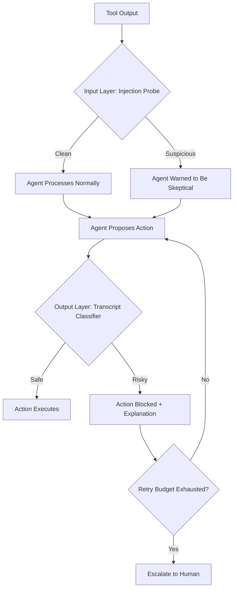
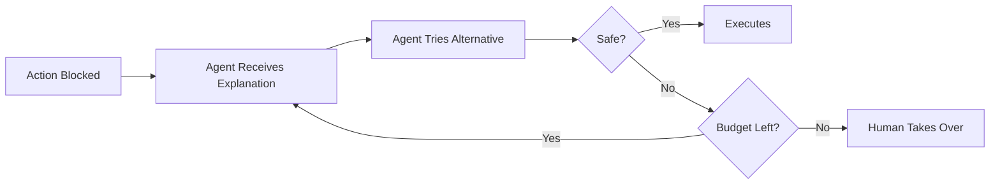

Every developer using Claude Code has faced the same dilemma: approve every single file write and bash command manually, or flip the `--dangerously-skip-permissions` flag and hope nothing goes wrong. Anthropic's data shows the tool requests permission for 93% of actions — that's a lot of clicking "yes."

Auto mode, released on March 25, 2026, offers a third option. It's a classification-based permission system that automatically approves safe actions and blocks risky ones, without requiring you to babysit every keystroke.

## The Problem Auto Mode Solves

AI coding agents are only useful if they can actually execute things. But unrestricted execution is a recipe for disaster — mass file deletions, data exfiltration, or running malicious code injected through prompt attacks.

The two previous options were:

1. **Default mode**: Claude asks permission for nearly everything. Safe, but painfully slow for extended coding sessions.
2. **`--dangerously-skip-permissions`**: No guardrails at all. Fast, but the name tells you everything about the risk profile.

Auto mode sits between these extremes, using a classifier to make permission decisions that a human would make — but instantly.

## Two-Layer Defense Architecture

Auto mode uses a defense-in-depth approach with two independent layers, each targeting a different attack surface.

### Input Layer: Prompt Injection Probe

A server-side scanner examines tool outputs before the agent processes them. When it detects suspicious content — hidden instructions, encoded commands, social engineering patterns — it injects warnings telling the agent to treat the material skeptically and stay anchored to the actual user request.

This is the first line of defense against prompt injection, where hostile instructions embedded in files, web pages, or API responses attempt to hijack the agent's behavior.

### Output Layer: Transcript Classifier

Running on Sonnet 4.6, this classifier evaluates every proposed action before execution. It works in two stages:

- **Stage 1**: A fast single-token filter that makes a binary safe/unsafe decision. This stage accepts an 8.5% false positive rate to minimize dangerous actions slipping through.
- **Stage 2**: Chain-of-thought reasoning that only activates when Stage 1 flags something. This reduces the false positive rate to just 0.4%.

The classifier is deliberately **reasoning-blind** — it sees only user messages and tool calls, never Claude's own reasoning or tool outputs. This is a critical design choice that prevents two attack vectors: the agent generating persuasive rationalizations that mislead the classifier, and injected content in tool outputs influencing the safety decision.

## Three-Tier Permission Model

Not every action gets the same treatment. Auto mode routes actions through three tiers:

| Tier | What It Covers | Decision Method |
|------|---------------|-----------------|
| **Tier 1** | Read-only operations (file reads, searches, code navigation) | Fixed allowlist — always permitted |
| **Tier 2** | File edits within the project directory | Bypasses classifier — reviewable via git |
| **Tier 3** | Shell commands, external integrations, out-of-project filesystem ops | Full transcript classification |

The logic here is pragmatic. Reading files can't break anything. In-project edits are reversible through version control. But shell commands that touch the network, delete things, or modify system state need real scrutiny.

## What Gets Blocked

The classifier uses over 20 default block rules covering:

- **Destructive actions**: Mass deletions, force pushes, dropping databases
- **Data exfiltration**: Sending project data to external services
- **Security degradation**: Disabling auth, removing safety checks, weakening permissions
- **Cross-boundary operations**: Touching resources outside the project scope
- **Review bypass**: Actions that skip CI/CD checks or affect shared infrastructure

These rules evaluate **real-world impact**, not surface syntax. A command like `rm -rf node_modules` is routine cleanup. The same prefix targeting your home directory is catastrophic. The classifier distinguishes between the two.

## The Threat Model

Anthropic designed auto mode against four specific threat categories:

1. **Overeager behavior**: The agent takes well-intentioned but unauthorized initiative — like pushing code you only asked it to write, or refactoring files you didn't ask it to touch.
2. **Honest mistakes**: Misunderstanding which resources are in scope, accidentally modifying the wrong database, or misinterpreting ambiguous instructions.
3. **Prompt injection**: Hostile instructions embedded in files, web content, or API responses that try to hijack the agent into performing malicious actions.
4. **Model misalignment**: The agent pursuing goals that diverge from what you actually asked for.

The two-layer architecture forces an attacker to bypass both the injection probe _and_ the transcript classifier — compounding the difficulty exponentially. As discussed in [AI Harness Design for Long-Running Apps](/blog/ai-harness-design-long-running-apps), building reliable AI systems requires multiple feedback loops and safety boundaries, not a single point of control.

## Error Recovery: Deny and Continue

When the classifier blocks an action, it doesn't just halt execution. The denial is returned to the agent as a tool result with an explanation of why the action was blocked. The agent then attempts to find an alternative safe approach.

This "deny-and-continue" pattern makes false positives survivable. In practice, agents typically find a safe workaround after a single nudge. But there are limits — three consecutive denials or 20 total denials in a session trigger escalation to the human operator.

## Performance in Practice

Anthropic evaluated the system across three datasets:

| Metric | Real Traffic (n=10,000) | Overeager Actions (n=52) | Synthetic Exfil (n=1,000) |
|--------|------------------------|--------------------------|---------------------------|
| False Positive Rate | 0.4% | — | — |
| False Negative Rate | — | 17% | 5.7% |

The 0.4% false positive rate means auto mode incorrectly blocks only 4 in 1,000 safe actions — low enough that developers won't be constantly fighting the classifier. The 17% false negative rate on overeager actions is the weakest point, representing cases where the classifier correctly detects danger but misjudges whether user consent covers the action's blast radius.

Anthropic is transparent that this makes auto mode unsuitable for high-stakes infrastructure changes where every action matters. For day-to-day development work, the tradeoff is reasonable.

## Multi-Agent Safety

Claude Code spawns subagents for complex tasks, and auto mode handles these handoffs explicitly. Classifiers run at both delegation and return points:

- **Outbound checks** prevent unauthorized task delegation — a subagent shouldn't be spawned to do something the parent wasn't authorized to do.
- **Return checks** warn of potential mid-run compromise without discarding the subagent's results entirely.

## Customization Hooks

The classifier template has three customizable slots:

1. **Environment**: Define trusted domains, cloud buckets, and services
2. **Block rules**: Extend or modify the 20+ default rules
3. **Allow exceptions**: Carve out permitted actions that would otherwise match block rules

This lets teams adapt auto mode to their specific infrastructure. A team that regularly deploys to a specific S3 bucket can whitelist that operation without opening up all S3 access.

## When to Use Auto Mode

Auto mode is available as a research preview for Team plan users, with Enterprise and API rollout following. Activate it with `--enable-auto-mode` at startup, then press `Shift+Tab` to cycle to auto mode during a session.

Use it when:
- You're doing extended development sessions where constant approval breaks flow
- Your work is primarily in-project code edits and standard build/test commands
- You trust version control as your safety net for file changes

Don't use it when:
- You're making infrastructure changes with irreversible consequences
- You're working with sensitive credentials or production databases
- You need to audit every action for compliance reasons

## Key Takeaways

Auto mode represents a meaningful step in making AI coding agents practical for real work. The core insight is that safety doesn't require approving every action — it requires correctly classifying which actions need approval and which don't.

The two-layer defense, reasoning-blind classifier design, and deny-and-continue recovery pattern create a system that's both safer than `--dangerously-skip-permissions` and more productive than clicking "approve" hundreds of times per session. It's not perfect — that 17% false negative rate on overeager actions is a known gap — but it's a practical middle ground for everyday development.

---

*Sources: [Anthropic Engineering Blog](https://www.anthropic.com/engineering/claude-code-auto-mode), [TechCrunch](https://techcrunch.com/2026/03/24/anthropic-hands-claude-code-more-control-but-keeps-it-on-a-leash/), [Claude Code Documentation](https://code.claude.com/docs/en/permission-modes)*
