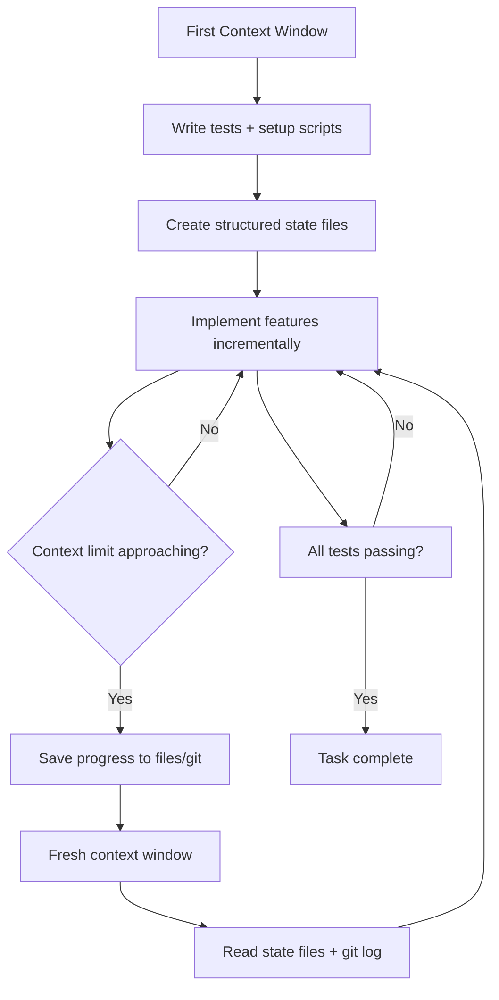

Most developers treat prompting like a Google search — type something vague and hope for the best. That works until your LLM-powered feature ships hallucinated data to production. Anthropic's latest prompting guide for Claude 4.6 reads less like a tutorial and more like an operator's manual, packed with techniques that separate fragile prompts from production-grade ones.

Here's what actually matters — distilled from [Anthropic's official best practices](https://platform.claude.com/docs/en/build-with-claude/prompt-engineering/claude-prompting-best-practices) and real-world experience building with the Claude API.

## The Golden Rule: Treat Claude Like a New Hire

Anthropic's single best piece of advice: **show your prompt to a colleague with minimal context on the task and ask them to follow it.** If they'd be confused, Claude will be too.

This reframes the entire exercise. You're not "talking to an AI" — you're writing an unambiguous spec for a brilliant contractor who knows nothing about your codebase, business rules, or conventions.

```text
❌ Less effective:
Create an analytics dashboard

✅ More effective:
Create an analytics dashboard. Include as many relevant features
and interactions as possible. Go beyond the basics to create a
fully-featured implementation.
```

The difference is night and day. Vague prompts produce generic output. Specific prompts produce specific results.

## Structure Prompts with XML Tags

XML tags are Claude's secret weapon for complex prompts. When your prompt mixes instructions, context, examples, and variable inputs, XML tags eliminate ambiguity about which section is which.

```xml
<documents>
  <document index="1">
    <source>annual_report_2023.pdf</source>
    <document_content>
      {{ANNUAL_REPORT}}
    </document_content>
  </document>
  <document index="2">
    <source>competitor_analysis_q2.xlsx</source>
    <document_content>
      {{COMPETITOR_ANALYSIS}}
    </document_content>
  </document>
</documents>

Analyze the annual report and competitor analysis.
Identify strategic advantages and recommend Q3 focus areas.
```

Best practices for XML structuring:

- Use consistent, descriptive tag names across your prompt library
- Nest tags when content has a natural hierarchy
- Wrap examples in `<example>` tags so Claude distinguishes them from instructions
- Use `<instructions>`, `<context>`, and `<input>` to separate prompt components

For few-shot prompting, 3–5 examples wrapped in `<examples>` tags dramatically improves accuracy and consistency. Make examples relevant to your actual use case, diverse enough to cover edge cases, and structured so Claude doesn't pick up unintended patterns.

## Explain Why, Not Just What

Providing context behind your instructions — the *motivation* — helps Claude generalize beyond the literal rule.

```text
❌ Less effective:
NEVER use ellipses

✅ More effective:
Your response will be read aloud by a text-to-speech engine,
so never use ellipses since the text-to-speech engine will not
know how to pronounce them.
```

When Claude understands why a rule exists, it can apply the spirit of the rule to situations you didn't explicitly cover. This is particularly powerful in [agentic systems](/blogs/ai-harness-design-long-running-apps) where Claude operates with less supervision.

## Adaptive Thinking: The New Default

Claude 4.6 introduces adaptive thinking (`thinking: {type: "adaptive"}`), replacing the old manual `budget_tokens` approach. The model now dynamically decides when and how much to think based on two factors: the `effort` parameter and query complexity.

```python
import anthropic

client = anthropic.Anthropic()

# Adaptive thinking — Claude decides when to think deeply
message = client.messages.create(
    model="claude-opus-4-6",
    max_tokens=64000,
    thinking={"type": "adaptive"},
    output_config={"effort": "high"},
    messages=[{"role": "user", "content": "..."}],
)
```

The recommended effort settings:

- **Low** — high-volume or latency-sensitive workloads
- **Medium** — most applications (Sonnet 4.6 default is `high`, so explicitly set this)
- **High** — agentic coding, multi-step tool use, complex reasoning
- **Max** — deep research, large-scale code migrations

You can also guide thinking behavior with prompts:

```text
After receiving tool results, carefully reflect on their quality
and determine optimal next steps before proceeding. Use your
thinking to plan and iterate based on this new information.
```

If Claude overthinks simple queries, add explicit constraints:

```text
Extended thinking adds latency and should only be used when it
will meaningfully improve answer quality — typically for problems
that require multi-step reasoning. When in doubt, respond directly.
```

## Tool Use: Be Explicit About Actions

Claude 4.6 follows instructions precisely — sometimes too precisely. If you say "can you suggest some changes," it will suggest instead of implementing. Tell Claude what to *do*, not what to *think about*.

```text
❌ Less effective (Claude will only suggest):
Can you suggest some changes to improve this function?

✅ More effective (Claude will make the changes):
Change this function to improve its performance.
```

For proactive action by default, add this to your system prompt:

```xml
<default_to_action>
By default, implement changes rather than only suggesting them.
If the user's intent is unclear, infer the most useful likely
action and proceed, using tools to discover any missing details
instead of guessing.
</default_to_action>
```

### Parallel Tool Calling

Claude 4.6 excels at parallel tool execution — running multiple searches, reading several files, and executing commands simultaneously. Boost this to near-100% reliability with:

```xml
<use_parallel_tool_calls>
If you intend to call multiple tools and there are no dependencies
between the calls, make all independent calls in parallel. Never
use placeholders or guess missing parameters in tool calls.
</use_parallel_tool_calls>
```

## Controlling Output Format

Claude's latest models are more concise by default — less verbose, more direct, less "AI-sounding." If that catches you off guard, here's how to steer formatting:

1. **Tell Claude what to do, not what to avoid** — Instead of "Don't use markdown," try "Write in smoothly flowing prose paragraphs."

2. **Use XML format indicators** — "Write prose sections in `<smoothly_flowing_prose_paragraphs>` tags."

3. **Match your prompt style to desired output** — Markdown in your prompt begets markdown in the output.

For prose-heavy output, this prompt template works well:

```xml
<avoid_excessive_markdown_and_bullet_points>
Write in clear, flowing prose using complete paragraphs. Reserve
markdown for inline code, code blocks, and simple headings. DO NOT
use ordered or unordered lists unless presenting truly discrete items
or the user explicitly requests it.
</avoid_excessive_markdown_and_bullet_points>
```

## Agentic Systems: Long-Horizon Reasoning

This is where Claude 4.6 really shines. The model maintains state across extended sessions, tracks progress incrementally, and manages context windows intelligently. Here's the flow for building reliable agentic systems:



Key patterns for multi-context-window workflows:

- **First window**: Set up the framework — write tests, create setup scripts, establish state tracking
- **Subsequent windows**: Iterate on a todo-list driven by test results
- **State tracking**: Use JSON for structured data (`tests.json`), freeform text for progress notes, and git for checkpoints
- **Verification**: Provide tools like Playwright or computer use so Claude can verify its own work

```json
{
  "tests": [
    { "id": 1, "name": "auth_flow", "status": "passing" },
    { "id": 2, "name": "user_mgmt", "status": "failing" },
    { "id": 3, "name": "api_endpoints", "status": "not_started" }
  ],
  "total": 200,
  "passing": 150,
  "failing": 25
}
```

Tell Claude not to quit early when context runs low:

```text
Your context window will be automatically compacted as it approaches
its limit. Do not stop tasks early due to token budget concerns.
Save your current progress and state to memory before the context
window refreshes.
```

## Taming Overeagerness

Claude 4.6 has a tendency to overengineer — creating extra files, adding unnecessary abstractions, building in flexibility nobody asked for. If you've worked with the [auto mode safety system](/blogs/claude-code-auto-mode-safety-through-classification), you'll know that managing Claude's autonomy is a real design problem.

The fix is explicit guardrails:

```text
Avoid over-engineering. Only make changes that are directly
requested or clearly necessary:

- Don't add features beyond what was asked
- Don't add docstrings to code you didn't change
- Don't add error handling for scenarios that can't happen
- Don't create abstractions for one-time operations
```

Similarly, if your older prompts used aggressive language like "CRITICAL: You MUST use this tool when...", dial it back. Claude 4.6 is far more responsive to system prompts and will overtrigger on language designed to compensate for older models' undertriggering.

## Subagent Orchestration

Claude 4.6 natively recognizes when tasks benefit from delegation to specialized subagents — and will do so proactively. The catch: it may overuse subagents when a direct approach is faster.

```text
Use subagents when tasks can run in parallel, require isolated
context, or involve independent workstreams. For simple tasks,
sequential operations, or single-file edits, work directly
rather than delegating.
```

## Migrating Away from Prefilled Responses

Prefilled responses on the last assistant turn are deprecated in Claude 4.6. Common migration paths:

| Old Approach | New Approach |
|---|---|
| Prefill for JSON output | Use Structured Outputs or explicit schema instructions |
| Prefill to skip preamble | System prompt: "Respond directly without preamble" |
| Prefill to avoid refusals | Not needed — Claude 4.6 handles refusals appropriately |
| Prefill for continuations | User message: "Continue from where you left off" |
| Prefill for context hydration | Inject reminders in user turns or hydrate via tools |

## Minimizing Hallucinations

For agentic coding contexts, this prompt pattern significantly reduces hallucinated code references:

```xml
<investigate_before_answering>
Never speculate about code you have not opened. If the user
references a specific file, you MUST read it before answering.
Investigate and read relevant files BEFORE answering questions
about the codebase.
</investigate_before_answering>
```

## Key Takeaways

1. **Write prompts like specs** — clear, unambiguous, testable by a human colleague
2. **Use XML tags** to structure complex prompts with mixed content types
3. **Explain the why** behind constraints so Claude can generalize
4. **Adopt adaptive thinking** with the `effort` parameter instead of manual `budget_tokens`
5. **Be explicit about actions** — tell Claude to *do*, not *suggest*
6. **Manage overeagerness** with explicit scope constraints
7. **Use structured state files** for long-horizon agentic tasks
8. **Migrate off prefills** — use Structured Outputs and direct instructions instead

The biggest shift in Claude 4.6 isn't a single technique — it's that the model is smart enough to need *less* prompting scaffolding and more *precise* prompting intent. Stop overengineering your prompts the same way you'd tell Claude to stop overengineering your code.
