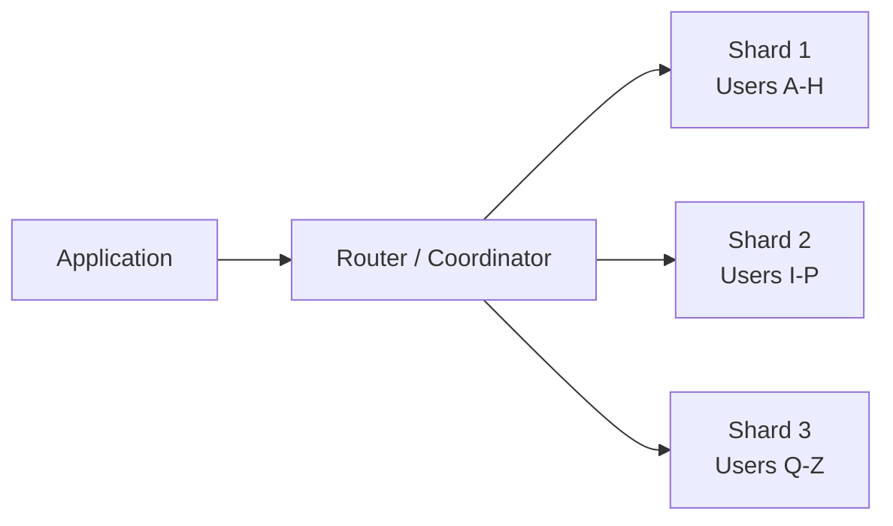
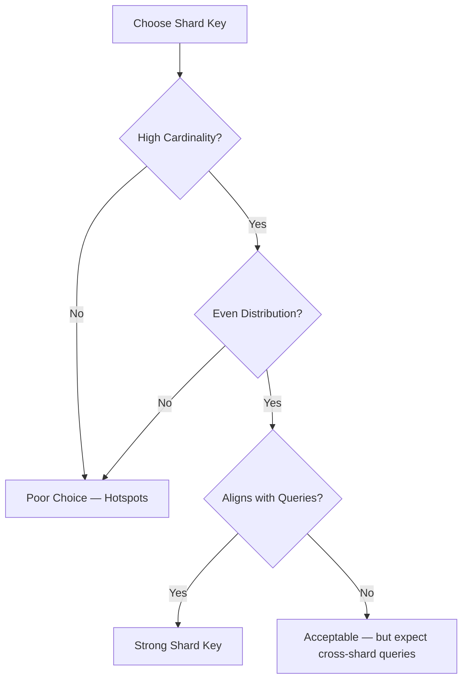
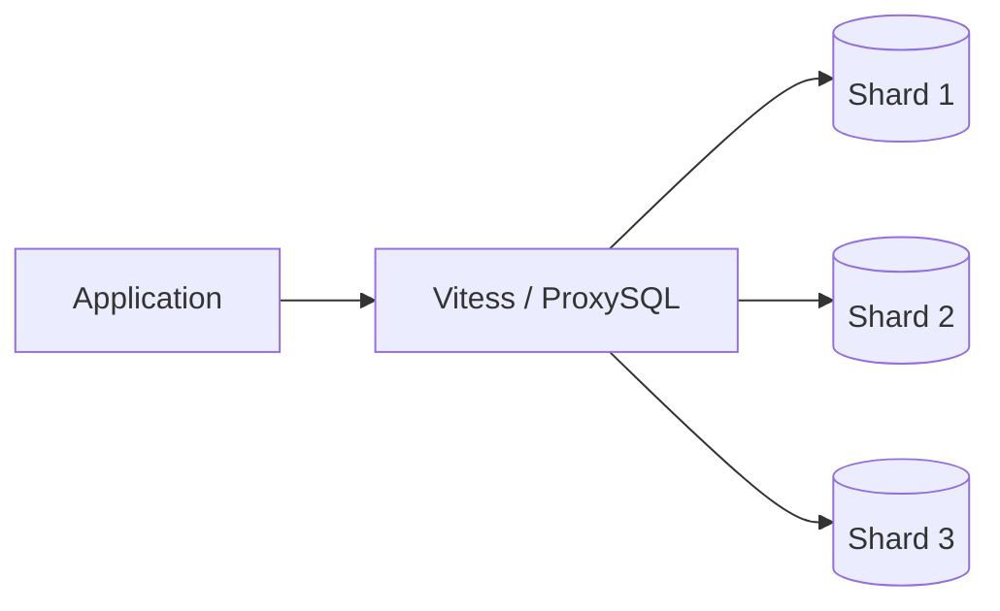

Your database is slow. Queries that took milliseconds now take seconds. You've added indexes, optimized queries, upgraded to a bigger machine — and you're still hitting the ceiling. This is the moment most engineering teams start hearing the word "sharding."

But sharding isn't a magic fix. It's a permanent architectural decision that trades simplicity for scale. Get it right and your system handles millions of users without breaking a sweat. Get it wrong and you've just created a distributed mess that's harder to debug, slower to query, and impossible to undo.

## What Is Database Sharding?

Sharding is the process of splitting a single large database into multiple smaller databases — called **shards** — each running on its own server. Every shard holds a subset of the total data, but they all share the same schema.

Unlike vertical scaling (buying a bigger machine), sharding is a form of **horizontal scaling**: you add more machines instead of upgrading existing ones. Each shard operates independently using a shared-nothing architecture, meaning no shard depends on another for its data or compute.



A routing layer sits between the application and the shards, directing each query to the correct shard based on a **shard key** — the column used to determine where each row lives.

## Sharding Strategies

There's no single "best" strategy. Each one optimizes for different query patterns and data distributions.

### Hash-Based Sharding

Apply a hash function to the shard key (like `user_id`) and use the result to pick a shard:

```
shard_number = hash(user_id) % number_of_shards
```

**Pros:** Even data distribution across shards. No hotspots if the hash function is good.

**Cons:** Adding or removing shards changes the modulo, requiring massive data migration. Consistent hashing mitigates this but adds complexity.

Hash-based sharding is the default recommendation for most workloads because it prevents the skew problems that plague other strategies.

### Range-Based Sharding

Assign shards based on contiguous ranges of the shard key:

- Shard A: `user_id` 1 – 1,000,000
- Shard B: `user_id` 1,000,001 – 2,000,000
- Shard C: `user_id` 2,000,001 – 3,000,000

**Pros:** Simple to implement and understand. Range queries (`WHERE created_at BETWEEN ...`) only hit one shard.

**Cons:** New data tends to cluster in the latest range, creating a **hot shard**. If you shard by timestamp, the newest shard handles all writes while older shards sit idle.

### Directory-Based Sharding

A lookup table maps each shard key value to a specific shard:

| user_id range | shard |
|---|---|
| 1-500K | shard-us-east |
| 500K-800K | shard-eu-west |
| 800K-1M | shard-ap-south |

**Pros:** Maximum flexibility. You can place data wherever makes sense — by customer, by region, by plan tier.

**Cons:** The directory itself becomes a single point of failure and a potential bottleneck. Every query requires a lookup before it can be routed.

### Geo-Based Sharding

A specialization of directory-based sharding where data routes by geographic region. A user in Tokyo hits the Asia-Pacific shard; a user in Berlin hits the EU shard.

**Pros:** Reduces latency by keeping data close to users. Helps with data residency compliance (GDPR, data sovereignty laws).

**Cons:** Uneven distribution if most of your users are in one region. Cross-region queries become expensive.

## Choosing the Right Shard Key

The shard key is the single most important decision in your sharding architecture. A bad key creates hotspots, forces cross-shard queries, and makes rebalancing painful. A good key has three properties:

1. **High cardinality** — many distinct values, so data spreads across shards evenly
2. **Even frequency** — no single value dominates (e.g., don't shard by `country` if 80% of users are in the US)
3. **Query alignment** — the key matches your most common query filters, so most queries hit a single shard



For a multi-tenant SaaS app, `tenant_id` is often ideal — each tenant's data is self-contained, queries rarely span tenants, and you get natural isolation. For a social platform, `user_id` works well since most operations are user-scoped.

Avoid composite keys unless necessary — they complicate routing logic and make rebalancing harder.

## When Should You Actually Shard?

Sharding is often a one-way door. Once your data model and application logic are wired for shards, unwinding that decision is extremely costly. Here's when it makes sense — and when it doesn't.

### Shard When

- **Single-server limits are real.** You've hit storage, memory, or I/O ceilings that vertical scaling can't solve cost-effectively.
- **Read/write throughput is maxed out.** Connection pooling, read replicas, and caching aren't enough.
- **Data volume is in the terabytes** and growing at a rate that will outpace a single node within months.
- **You need fault isolation.** One tenant or region going down shouldn't take the whole system with it.

### Don't Shard When

- **You haven't exhausted simpler optimizations.** Indexing, query optimization, connection pooling, read replicas, and caching should all come first.
- **Your dataset is small to moderate.** If your data fits comfortably on one machine, sharding adds complexity for no benefit.
- **Your team lacks operational maturity.** Sharding multiplies your ops burden — backups, schema migrations, monitoring, and debugging all get harder.

As covered in [designing rate limiters at scale](/blogs/designing-rate-limiters-at-scale/), distributed systems introduce coordination challenges at every layer. Sharding is no different — it's a tool for when you've genuinely outgrown a single database, not a premature optimization.

## The Hard Parts: Challenges in Production

### Cross-Shard Queries

A query that needs data from multiple shards is a **scatter-gather** operation: the coordinator sends the query to all relevant shards, collects results, and merges them. This is slower than single-shard queries and consumes more resources.

Design your schema and shard key to minimize cross-shard queries. If 80% of your queries need to join across shards, your sharding strategy is wrong.

### Distributed Transactions

Transactions spanning multiple shards require protocols like **two-phase commit (2PC)**, which adds latency and failure modes. Many teams avoid distributed transactions entirely, opting for eventual consistency or saga patterns instead.

### Rebalancing

When a shard grows too large or too hot, you need to split it or redistribute data. This involves:

1. Provisioning new shards
2. Migrating data while the system is live
3. Updating routing rules
4. Verifying data integrity

Without consistent hashing or a directory-based approach, adding a single shard can trigger migration of a large percentage of your data.

### Schema Migrations

Changing a table's schema means running the migration on every shard — and they all need to succeed. A failed migration on shard 7 while shards 1-6 succeeded puts your cluster in an inconsistent state.

Tools like `gh-ost` (GitHub's online schema migration tool) help, but the operational burden is real.

### Operational Overhead

Every shard needs monitoring, alerting, backups, and capacity planning. Three shards means three times the operational surface area. Debugging a production issue might require querying multiple shards and correlating results manually.

## Implementation Approaches

### Application-Layer Sharding

Your application code contains the routing logic. You hash the key, pick the shard, and connect to the right database.

```typescript
function getShardConnection(userId: number): Database {
  const shardIndex = hash(userId) % SHARD_COUNT;
  return shardConnections[shardIndex];
}

// Usage
const db = getShardConnection(userId);
const user = await db.query('SELECT * FROM users WHERE id = $1', [userId]);
```

**Pros:** Full control, no middleware overhead.

**Cons:** Sharding logic is coupled to your application. Every service that touches the database needs to know about shards.

### Middleware / Proxy Layer

Tools like **Vitess** (used by YouTube), **ProxySQL**, or **Citus** (for PostgreSQL) sit between your app and database, handling routing transparently.



**Pros:** Application code stays clean — it thinks it's talking to one database.

**Cons:** Another infrastructure component to operate and debug.

### Native Distributed Databases

Systems like **CockroachDB**, **TiDB**, **YugabyteDB**, and **MongoDB** handle sharding internally. You write queries against what looks like a single database, and the system distributes data across nodes.

**Pros:** Least operational burden. Automatic rebalancing, failover, and scaling.

**Cons:** Less control over data placement. Vendor lock-in risk. Performance characteristics differ from traditional databases.

## Sharding vs. Partitioning

These terms are often confused. The key difference:

- **Partitioning** splits data within a single database server. PostgreSQL's declarative partitioning, for example, divides a table into partitions that all live on the same machine.
- **Sharding** splits data across multiple independent servers.

Partitioning improves query performance by letting the database skip irrelevant partitions. Sharding improves throughput and capacity by distributing load across machines. They're complementary — you can partition within each shard.

## Key Takeaways

1. **Shard as a last resort**, not a first optimization. Exhaust indexing, caching, read replicas, and connection pooling before reaching for sharding.
2. **The shard key decides everything.** Pick one with high cardinality, even distribution, and alignment with your query patterns.
3. **Hash-based sharding is the safest default** for most workloads, but consider range-based for time-series data and geo-based for compliance needs.
4. **Design for single-shard queries.** If most operations hit one shard, your system stays fast and simple. Cross-shard joins are the enemy.
5. **Budget for operational complexity.** Schema migrations, monitoring, rebalancing, and debugging all multiply with each shard you add.

Database sharding is a powerful tool — but it's a power tool, not a screwdriver. Use it when the problem genuinely demands it, and invest the engineering effort to get the fundamentals right.
