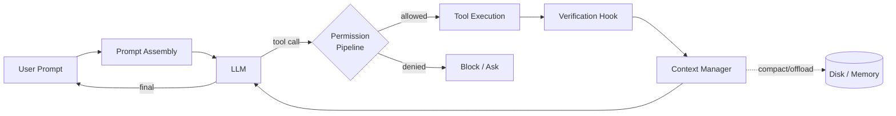

In 2025, LangChain's coding agent sat outside the top 30 on TerminalBench. In early 2026, it ranked fifth. The model didn't change — the harness did. That single data point, called out in multiple recent write-ups on agent architecture, sums up the shift happening across the industry: **the model is not the product anymore. The harness is.**

A raw LLM is a text generator — brilliant, uncontrolled, and useless at a ten-step task. What turns it into Claude Code, Cursor, or an autonomous research agent is the scaffolding around it: the tool loop, the context manager, the permission pipeline, the verification hooks. That engineering discipline has a name now. It's called **harness engineering**, and it's where most of the leverage in AI product work lives.

## What a harness actually does

Every production agent — Claude Code, Cursor, Devin, deep-research bots — sits inside a harness that handles five responsibilities the model can't do for itself:

1. **Orchestration loop** — the Thought → Action → Observation cycle. The model emits a tool call, the harness dispatches it, the result comes back, the loop continues until a stop condition fires.
2. **Context management** — stuffing the right tokens into the window, compacting older turns, offloading state to disk, and keeping the agent from collapsing under its own history.
3. **Tool exposure** — typed schemas, validation, sandboxing, and progressive disclosure so the model isn't drowning in 200 tool descriptions at every turn.
4. **Permission enforcement** — a separate code path that decides whether a tool call is *allowed*, independent of the model's judgment.
5. **Verification and persistence** — tests, typechecks, visual diffs, and memory files that catch hallucinations before they compound and carry state across sessions.



Mitchell Hashimoto's definition is the one that sticks: harness engineering is *"anytime you find an agent makes a mistake, you take the time to engineer a solution such that the agent never makes that mistake again."* Everything above is the surface area where that engineering happens.

## Scaffolding is built once. The harness runs every turn.

A useful distinction: **scaffolding** is what you assemble before the first prompt — system prompts, tool registries, CLAUDE.md files, MCP servers. It's cold, static, inspectable. The **harness** is what runs at request time — the loop, the permission checks, the context compaction, the hook firings. It's hot, stateful, adversarial.

Both matter. But they fail in different ways. Bad scaffolding means your agent starts confused. Bad harness means your agent degrades as the session grows. The first is a configuration problem; the second is a systems problem.

This is why prompt engineering is a *subset* of harness engineering, not a substitute for it. As covered in [Claude prompting best practices for 2026](/blogs/claude-prompting-best-practices/), a good prompt is necessary — but a good prompt inside a bad loop still produces a bad product.

## Pillar 1: Context is a scarce resource

The single most important mental model in harness engineering is this: **context is not a bucket you fill, it's a signal you curate.** Research from Chroma across 18 models found performance degrades as the window fills, even when total tokens are well under the technical limit. One recent anatomy piece quotes a 30%+ performance drop when key content lands mid-window, and notes that many agents start losing coherence past 40% utilization.

Claude Code addresses this aggressively — roughly 95% of its available context is loaded lazily, not upfront. The harness patterns that make this work:

- **Compaction** — summarize older turns while preserving architectural decisions and unresolved TODOs.
- **Observation masking** — keep tool *calls* visible but hide older tool *outputs*; the model remembers what it did, not the verbose diff it read.
- **Just-in-time retrieval** — lightweight identifiers in context (filepath, line number, doc ID); load the body only when needed.
- **Sub-agent delegation** — dispatch a fresh context to a sub-agent, let it burn 50k tokens, get back a 2k-token summary.

The sub-agent pattern is especially powerful because it side-steps "context rot" entirely. The parent agent never sees the mess. This connects directly to [the brain/hands split in managed agents](/blogs/scaling-managed-agents-brain-hands/) — context isolation is how you scale reasoning across many sessions without collapse.

## Pillar 2: Fewer tools, better tools

Intuition says more tools = more capability. Intuition is wrong. When Vercel's v0 team removed roughly 80% of their tools, quality went *up*. One recent harness write-up documented a Linear MCP integration shrinking its tool descriptions by thousands of tokens and seeing better outcomes. An ETH Zurich study found LLM-generated agentfiles *hurt* performance while costing 20%+ more, and agents spent 14–22% more reasoning tokens processing context-file instructions without improving resolution rates.

Why? Every tool schema in context is a distraction. The model has to consider it at every turn, even when it's irrelevant. The harness's job is to keep only the tools the current task needs visible, and load the rest on demand.

The Claude Code approach is instructive — tools come in layers:

```ts
// Core tools: always loaded, small, general-purpose
const coreTools = [Read, Edit, Grep, Glob, Bash];

// Deferred tools: surfaced by name, schemas loaded via ToolSearch
const deferredTools = [WebFetch, NotebookEdit, ...mcpTools];

// Skills: progressive disclosure of structured knowledge
const skills = loadSkillIndex(); // one-line entries, bodies on demand
```

The model sees an *index* of what's available, and fetches the schema only when it intends to use it. This is the harness equivalent of lazy loading — and it's the single biggest unlock for long-running agents.

## Pillar 3: Permissions are a separate code path

A jailbroken model cannot override a permission check it never sees. This is the underrated security property of a well-designed harness: **the model decides what it wants to do; a separate system decides whether it's allowed.**

Claude Code's permission pipeline is layered:

1. General rules (allow lists, deny lists, ask lists)
2. Tool-specific checks (custom logic per tool)
3. Automated classifiers (fast-path approval for safe patterns)
4. Interactive fallback (ask the human)

The classifier layer is what makes autonomous operation tolerable. Anthropic's data shows Claude Code requests permission on 93% of actions by default — a usability disaster. The auto-mode classifier cuts that dramatically by approving patterns it's confident are safe. I wrote about that mechanism in more depth in [Claude Code Auto Mode: Safety Through Classification](/blogs/claude-code-auto-mode-safety-through-classification/).

The architectural lesson: permission decisions live in deterministic code, not model reasoning. Hooks (PreToolUse, PostToolUse, SessionStart) give you surgical control points that fire regardless of what the model does or doesn't say.

## Pillar 4: Verification loops beat bigger models

A ten-step task where each step succeeds with 99% probability has a 90.4% end-to-end success rate. Push the task to 50 steps and you're at 60%. This compounding-failure math is why long-running agents are so hard — and why verification loops matter more than raw model quality.

Published numbers on verification-loop impact are striking: rules-based feedback, visual diffs, and LLM-as-judge setups consistently show **2–3x quality improvements** without changing the model. The pattern: generate, check, correct, repeat. The harness owns the "check" step with deterministic hooks — typecheckers, test runners, build commands — that fire silently on success and surface only errors back to the model.

This is the core insight of [AI harness design for long-running apps](/blogs/ai-harness-design-long-running-apps/): splitting the agent into a generator and an evaluator, with the harness mediating between them, is what produces complex software. Single-shot agents don't. They can't see their own mistakes.

## The future-proofing test

Here's the test I apply to any harness pattern I'm about to add: **does this complexity shrink as models improve?** If yes, the pattern is sound. If no, I'm building a cage the next model will outgrow.

One agent project was reportedly rebuilt five times in six months — each rewrite *removed* harness complexity as the underlying model got better. Explicit state machines became implicit reasoning. Hardcoded planning templates became plain prompts. The harness got thinner; the agent got better.

The corollary: resist the urge to solve model weaknesses with harness complexity. Sometimes the right answer is to wait three months for a stronger model rather than build infrastructure you'll rip out.

## Takeaways

- **The model provides intelligence. The harness provides control.** Most of your leverage as an AI engineer lives in the harness, not the prompt.
- **Context is a signal, not a bucket.** Compact, mask, offload, and delegate. Fewer, better tokens beat more tokens.
- **Fewer tools usually win.** Every schema in context is a tax on the model's attention.
- **Permissions belong in code, not prompts.** A separate code path is jailbreak-resistant by construction.
- **Verification loops compound quality.** A 2–3x improvement from a feedback loop is cheaper than waiting for the next model release.
- **Build for disposability.** The best harness is the one you can delete when the model catches up.

Harness engineering isn't glamorous. No one writes Twitter threads about their permission classifier. But it's where the difference between a demo and a product gets decided — and right now, it's the most leveraged skill an AI engineer can develop.
