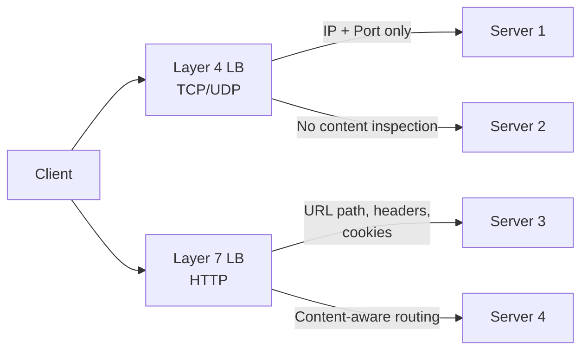
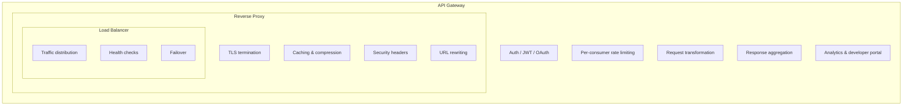
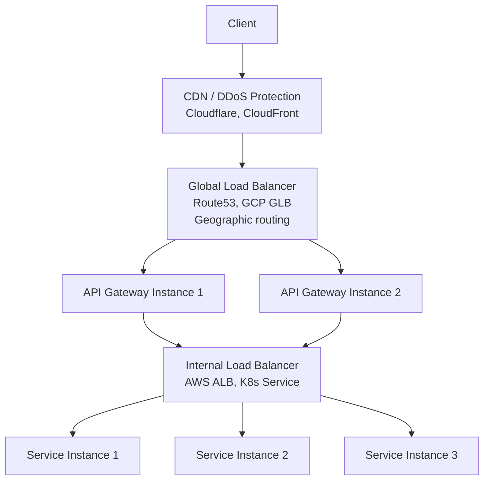

Three terms show up in every system design discussion — and every system design interview — yet most engineers use them interchangeably. Load balancers, API gateways, and reverse proxies are related, they overlap, and in some cases a single tool can play all three roles. But they solve fundamentally different problems, and conflating them leads to architectures that are either over-engineered or missing critical pieces.

This post breaks down what each component actually does, where the boundaries blur, and how they compose in real production systems.

## Reverse Proxy: The Frontend Bodyguard

A reverse proxy sits between clients and your backend servers. Clients never talk to your application directly — they talk to the proxy, which forwards requests on their behalf.

The "reverse" distinguishes it from a forward proxy (like a corporate web filter). A forward proxy acts on behalf of the client. A reverse proxy acts on behalf of the server.

**What it handles:**

- **TLS termination** — decrypt HTTPS at the proxy so backends handle plain HTTP
- **Compression and caching** — gzip responses, cache static assets
- **Security** — hide backend IPs, add security headers (HSTS, CSP, X-Frame-Options), filter malicious requests
- **URL rewriting** — map public URLs to internal service paths

A basic Nginx reverse proxy config looks like this:

```nginx
server {
    listen 443 ssl;
    server_name api.example.com;

    ssl_certificate     /etc/ssl/certs/api.example.com.pem;
    ssl_certificate_key /etc/ssl/private/api.example.com.key;

    location / {
        proxy_pass http://backend:8080;
        proxy_set_header Host $host;
        proxy_set_header X-Real-IP $remote_addr;
        proxy_set_header X-Forwarded-For $proxy_add_x_forwarded_for;
        proxy_set_header X-Forwarded-Proto $scheme;
    }
}
```

The client sees `api.example.com`. It has no idea whether the backend is one server or fifty. That abstraction is the reverse proxy's core job.

**Common tools:** Nginx, Caddy, Traefik, Apache HTTP Server

## Load Balancer: The Traffic Distributor

A load balancer distributes incoming requests across multiple instances of the same service. If a reverse proxy hides your backend, a load balancer multiplies it.

The key distinction is **two layers** of load balancing:



**Layer 4 (Transport)** routes based on IP address and port. It never inspects the HTTP payload, which makes it fast — sub-millisecond routing. Use it for non-HTTP protocols, gaming servers, IoT, or when you need static IPs per availability zone (AWS NLB).

**Layer 7 (Application)** inspects HTTP content — URL paths, headers, cookies, query strings. Slower by 0.1–1ms, but you can route `/api/users` to the user service and `/api/orders` to the order service from a single entry point.

### Load Balancing Algorithms

| Algorithm | How It Works | Best For |
|-----------|-------------|----------|
| Round Robin | Rotate through servers sequentially | Equal-capacity servers |
| Least Connections | Send to the server with fewest active connections | Varying request durations |
| IP Hash | Hash client IP to a consistent server | Session affinity without cookies |
| Weighted | Assign capacity weights to servers | Mixed hardware generations |

An Nginx upstream block with least connections and health checks:

```nginx
upstream backend_pool {
    least_conn;
    server 10.0.1.10:8080 weight=3 max_fails=3 fail_timeout=30s;
    server 10.0.1.11:8080 weight=2 max_fails=3 fail_timeout=30s;
    server 10.0.1.12:8080 backup;
}
```

The `backup` server only receives traffic when all primary servers are down — a simple failover pattern.

**Common tools:** HAProxy, Nginx, AWS ALB (L7), AWS NLB (L4), GCP Load Balancer, Envoy

## API Gateway: The Management Layer

An API gateway does everything a reverse proxy does — and then adds a full API management plane on top. If a reverse proxy is a bouncer checking IDs at the door, an API gateway is the entire security system plus the guest list, the VIP section, and the event analytics.

**What it adds beyond a reverse proxy:**

- **Authentication and authorization** — validate JWTs, OAuth tokens, API keys centrally
- **Rate limiting** — per-consumer, per-API-key, per-endpoint throttling (not just per-IP)
- **Request/response transformation** — reshape payloads, add/remove headers, translate between protocols
- **Response aggregation** — fan out to multiple services, merge results into a single response
- **Protocol translation** — accept REST, route to gRPC backends
- **API versioning** — route `/v1/users` and `/v2/users` to different service versions
- **Analytics and monitoring** — track API usage, latency percentiles, error rates per consumer
- **Developer portal** — documentation, API key management, usage dashboards

Rate limiting is one of the most common reasons teams adopt an API gateway. Unlike IP-based rate limiting at the proxy level, an API gateway can enforce limits per API key or per authenticated user — which is what you actually need when exposing APIs to third-party developers. For a deeper dive into rate limiting strategies, see [Designing Rate Limiters at Scale](/blogs/designing-rate-limiters-at-scale/).

**Common tools:** Kong, AWS API Gateway, Apigee, Apache APISIX, Tyk, Azure API Management

## The Superset Relationship

These three components form a hierarchy — each layer includes the capabilities of the one below it:



**API Gateway ⊃ Reverse Proxy ⊃ Load Balancer.** This is a superset relationship, not a replacement hierarchy. You don't swap one for another — you layer them based on what your architecture needs.

This is also why Nginx can serve as all three. Kong is literally Nginx with an API management layer bolted on (via OpenResty/Lua). HAProxy is a load balancer that also does sophisticated L7 routing. AWS ALB is called a "load balancer" but supports path-based routing, header inspection, and authentication — features typically associated with API gateways.

## How They Work Together in Production

In a real microservices deployment, you typically use all three at different points in the request path:



Each layer has a distinct job:

1. **Global load balancer** — routes users to the nearest region
2. **API gateway** (multiple instances behind the global LB) — handles auth, rate limiting, routing to the correct service
3. **Internal load balancer** — distributes traffic across instances of a single service

Netflix pioneered this pattern with AWS ELB → Zuul (API gateway) → service instances. Zuul handled dynamic routing, canary deployments, and circuit breaking while ELB handled the raw traffic distribution.

### Kubernetes Context

In Kubernetes, these concepts map to specific abstractions:

- **Ingress Controller** = reverse proxy + basic routing (Nginx Ingress, Traefik)
- **Gateway API** = newer, more expressive replacement for Ingress, supports multi-tenancy
- **Service** (ClusterIP/NodePort) = internal load balancer across pods
- **Service Mesh** (Istio/Linkerd) = east-west traffic management between services (mTLS, circuit breaking, observability)

The Ingress or Gateway API handles north-south traffic (external → cluster). The service mesh handles east-west traffic (service → service). They're complementary, not competing.

## Choosing the Right Tool

The decision tree is simpler than it looks:

**Single app, need TLS and caching?** → Reverse proxy (Nginx, Caddy)

**Multiple instances of the same app?** → Add a load balancer (Nginx upstream, HAProxy, cloud LB)

**Multiple services, need auth and rate limiting?** → API gateway (Kong, AWS API Gateway)

**Microservices at scale?** → All three, layered

### Tool Comparison

| Tool | Primary Role | L4 | L7 | API Management | Best For |
|------|-------------|:---:|:---:|:--------------:|---------|
| Nginx | Reverse proxy | — | Yes | Limited | TLS termination, static files, basic LB |
| HAProxy | Load balancer | Yes | Yes | No | High-throughput TCP/HTTP load balancing |
| Kong | API gateway | — | Yes | Yes (50+ plugins) | Full API lifecycle, plugin ecosystem |
| Envoy | Proxy/data plane | Yes | Yes | Via control plane | gRPC, service mesh, deep observability |
| Traefik | Reverse proxy | Yes | Yes | Basic | Docker/K8s auto-discovery, Let's Encrypt |
| AWS ALB | Load balancer | — | Yes | Basic | AWS-native HTTP workloads |
| AWS NLB | Load balancer | Yes | — | No | Ultra-low latency, static IPs, non-HTTP |

### Performance Considerations

API gateways add overhead. Official F5 benchmarks show Kong processes about 2.6x less throughput than raw Nginx — the Lua plugin layer has a cost. Kong reaches capacity around 5,000 req/s per instance at high CPU utilization, while Nginx handles significantly more.

For most API workloads, this overhead is acceptable. But if you're routing high-throughput internal traffic that doesn't need auth or rate limiting, putting it through an API gateway is waste. Use an internal load balancer for service-to-service traffic and reserve the API gateway for the edge.

Budget 1–5ms of additional latency per request for API gateway processing (auth validation + plugin execution). Factor this into your SLA calculations — if your service targets p99 latency of 50ms, the gateway eats 2–10% of that budget before your code even runs.

## Common Mistakes

**Using an API gateway for everything.** Internal service-to-service calls don't need JWT validation or rate limiting. Route them through a simple load balancer or service mesh.

**Skipping the load balancer because the API gateway "does it."** API gateways do basic load balancing, but dedicated load balancers handle failover, health checks, and connection draining better. Layer them.

**Running a single API gateway instance.** Your gateway is now a single point of failure. Always deploy multiple instances behind a load balancer. The same principle applies to databases — as your system scales, even your [database layer needs distribution strategies](/blogs/database-sharding-explained/).

**Choosing based on features instead of operational complexity.** Envoy has the best observability features. It also has the steepest learning curve and needs a control plane for complex deployments. Start with what your team can operate, not what has the most checkboxes.

## Key Takeaways

- A **reverse proxy** hides and protects your backends. A **load balancer** distributes traffic across them. An **API gateway** manages who can access them and how.
- They form a superset hierarchy: API Gateway ⊃ Reverse Proxy ⊃ Load Balancer. Use the simplest layer that solves your actual problem.
- In production microservices, you layer all three: global LB → API gateway → internal LB → services.
- Reserve API gateways for the edge (north-south traffic). Use simple load balancers or service meshes for internal (east-west) traffic.
- Choose tools based on operational complexity your team can handle, not feature count. Nginx covers 80% of use cases. Add Kong or Envoy when you genuinely need API management or service mesh capabilities.
