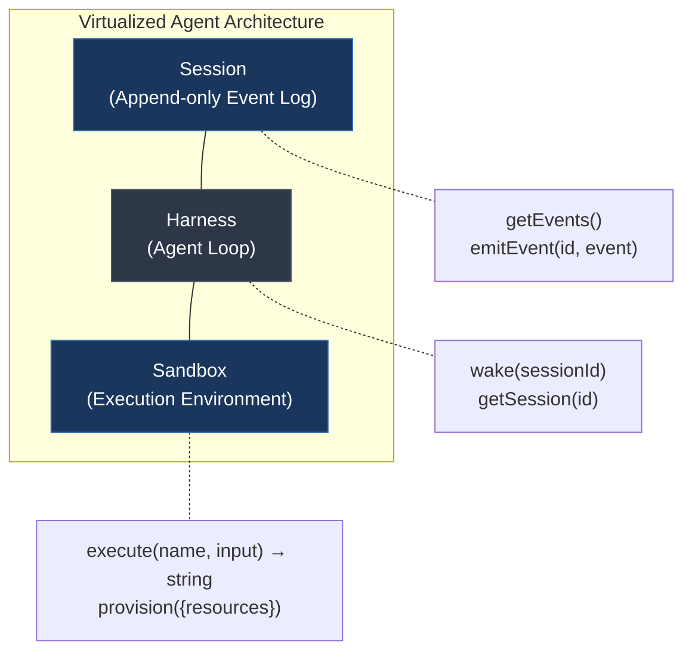
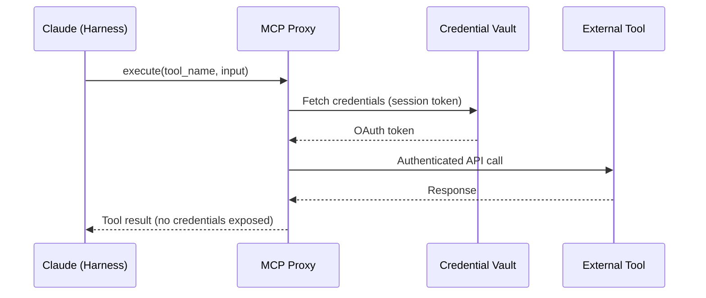
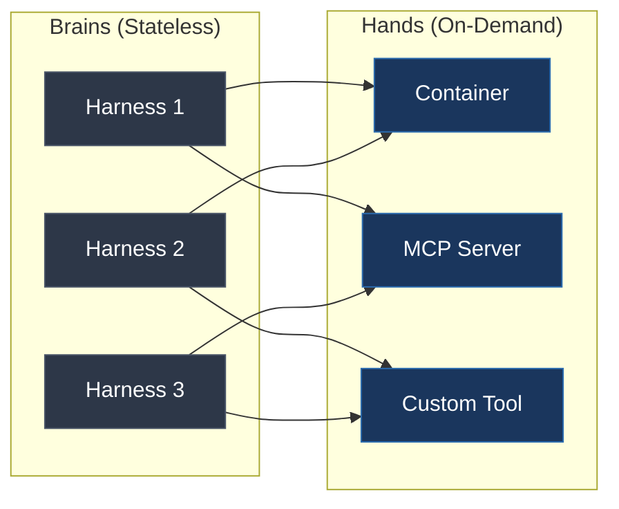

Your AI agent just crashed mid-task. The container died, the session vanished, and all context—every file edit, every tool call, every decision—is gone. Restart from scratch and pray it works this time.

This was the reality of early agent architectures. Anthropic's engineering team hit this wall building Claude's agent infrastructure and arrived at a surprisingly old-school solution: treat agents like operating systems treat hardware. Their [engineering blog post](https://www.anthropic.com/engineering/managed-agents) on scaling Managed Agents lays out the architecture, and it's a masterclass in decoupled system design.

## The Problem: Hardcoded Assumptions Rot Fast

Agent harnesses—the loops that call the model, route tool calls, and manage context—inevitably encode assumptions about what the model can and can't do. Anthropic discovered this firsthand when earlier Claude models exhibited "context anxiety," wrapping up tasks prematurely as context windows filled up. They added context resets to compensate.

Then Claude Opus 4.5 shipped. The anxiety disappeared entirely. Those context resets became dead weight—unnecessary code that added complexity without value. The harness had been designed around a limitation that no longer existed.

This is the core problem: **model capabilities evolve faster than the harnesses built around them**. Every workaround you bake in today becomes technical debt tomorrow. The question is how to build infrastructure that doesn't make assumptions about the model running inside it.

## The Solution: Virtualize Everything

Anthropic borrowed a pattern that operating systems perfected decades ago. Just as OSes virtualize hardware—abstracting processes, file systems, and I/O so programs don't care about the underlying machine—Managed Agents virtualize three agent components behind stable interfaces.

### Session: The Durable Event Log

The session is an append-only log of everything that happened—tool calls, model responses, user messages. It lives outside Claude's context window and serves as the single source of truth.

The interface is intentionally minimal: `getEvents()` for flexible querying via positional slices, and `emitEvent(id, event)` for durability. This lets the harness rewind to specific moments, reread context before critical actions, or selectively load events into the context window.

### Harness: The Replaceable Brain

The harness calls Claude and routes tool calls to infrastructure. It's now a stateless process that can crash and recover without losing work. When a harness dies, a new one boots via `wake(sessionId)`, recovers the event log with `getSession(id)`, and resumes from the last recorded event.

No manual nursing. No lost sessions. The harness went from a "pet" you name and pamper to "cattle" you replace on failure.

### Sandbox: The Disposable Hands

The sandbox is where Claude actually runs code, edits files, and interacts with the world. It's called via `execute(name, input) → string` and provisioned on-demand with `provision({resources})`.

When a container fails, it triggers a tool-call error returned to Claude. Claude retries with a freshly provisioned container. Zero manual intervention. The harness doesn't care whether the "hand" it's calling is a Docker container, an MCP server, or—as the Anthropic team noted—a Pokémon emulator. Anything that implements the `execute` interface works.

## Why Coupling Kills: The Pets vs. Cattle Problem

Anthropic's initial design ran everything—inference, session state, and execution—in a single container. This created what the industry calls a "pet": a named, irreplaceable entity that everyone tiptoes around.

The consequences were predictable:

- **Container failure = total loss.** Session state lived in the same process, so a crash wiped everything.
- **Debugging was impossible.** Inspecting a failed session meant exposing user data to engineers inside the same container.
- **Scaling was rigid.** Co-located infrastructure assumed everything lived on the same machine, blocking cloud connectivity.
- **Security was structural.** Credentials shared the same address space as untrusted LLM-generated code. A prompt injection that escaped the sandbox could access repository tokens.

Decoupling solved all four problems simultaneously. Not by adding defensive code, but by making the architecture structurally resistant to these failure modes. As we explored in [AI harness design for long-running apps](/blogs/ai-harness-design-long-running-apps/), the generator-evaluator split is one pattern for building resilient agent loops—Anthropic's virtualization pattern takes this further by making each component independently replaceable.

## Security Through Separation, Not Rules

The security model deserves special attention because it's a genuine architectural insight, not just another "add authentication" story.

In the coupled design, repository tokens and OAuth credentials lived in the same container as untrusted code. If a [prompt injection attack](/blogs/claude-code-auto-mode-safety-through-classification/) succeeded, the attacker had access to everything in that process.

Decoupling creates structural separation:

**Git credentials** initialize sandbox setup and wire into local git remotes. Push and pull operations work without the agent ever handling tokens directly.

**OAuth tokens** for custom tools live in secure vaults outside sandboxes. When Claude calls an MCP tool, the request goes through a dedicated proxy. The proxy fetches credentials using session-associated tokens. The harness never sees credentials, and neither does the sandbox.

This means a compromised sandbox can't exfiltrate tokens or spawn unrestricted sessions. The security boundary isn't enforced by code that runs alongside untrusted code—it's enforced by the fact that secrets never enter the sandbox at all.

## Performance: Start Thinking Before Building

The performance gains from decoupling were dramatic:

| Metric | Improvement |
|--------|-------------|
| p50 Time-to-First-Token | ~60% reduction |
| p95 Time-to-First-Token | >90% reduction |

The reason is straightforward. In the coupled design, every session paid full container setup costs upfront—cloning repositories, booting processes, fetching events—even sessions that never needed a sandbox. Most agent interactions don't touch a container at all. They just think.

With decoupled architecture, inference starts immediately once the orchestration layer retrieves pending events. Containers provision only when Claude actually calls `execute()`. You're no longer blocking the brain while the hands are warming up.

This mirrors a pattern familiar to anyone who's worked with [serverless architectures](/blogs/optimizing-aws-lambda-performance-cost-and-cold-starts/)—defer expensive initialization until it's actually needed.

## Many Brains, Many Hands

The most powerful consequence of decoupling is compositional scaling. Each brain can reach multiple execution environments, and each sandbox can serve multiple brains.

Scaling to multiple brains means starting stateless harnesses and connecting them to hands only when needed. Brains can delegate hands to one another. The harness doesn't know or care what kind of hand it's talking to—it just calls `execute(name, input)` and gets back a string.

This is the same principle behind microservice architectures: define interfaces, not implementations. Different harness implementations (Claude Code, task-specific agents, custom orchestrators) all fit the same framework. As model intelligence scales, harness implementations swap freely without disturbing the stable interfaces.

## What This Means for Your Agent Architecture

Anthropic's Managed Agents service went into [public beta in April 2026](https://platform.claude.com/docs/en/managed-agents/overview), priced at $0.08 per session-hour plus standard token costs. But the architectural patterns matter more than the specific product.

If you're building agent infrastructure, the key takeaways are:

1. **Separate state from compute.** Your session log should survive any component failure. Make it append-only and queryable.
2. **Make the harness stateless.** If your agent loop can't recover from a crash by reading the event log, you have a pet, not cattle.
3. **Defer sandbox provisioning.** Don't pay container setup costs for sessions that might never need execution.
4. **Enforce security structurally.** Keep credentials out of the execution environment entirely. Use proxies, not access controls within the sandbox.
5. **Design interfaces, not implementations.** The `execute(name, input) → string` contract is deceptively powerful. Anything that implements it becomes a "hand."

The Anthropic team summarized their philosophy well: be strongly opinionated about *interfaces* while remaining unopinionated about *implementations*. That's not just good agent design—it's good distributed systems design. And it's the same principle that let operating systems run programs "as yet unthought of" on hardware "as yet unbuilt."

The models will keep getting smarter. The infrastructure should be ready for capabilities that don't exist yet. Virtualizing the components—just like OS designers did decades ago—is how you build for that future.
